<!-- _class: title -->

# ハンズオン: <br>サーバーレスアプリケーション入門

AWS のフルマネージドサービスを利用した
サーバーレス Web アプリケーションの構築

---
<!-- paginate: true -->

# 準備

- GitHub のアカウント
- AWS のアカウント
[AWS アカウント作成の流れ | AWS](https://aws.amazon.com/jp/register-flow/)
- テキストエディタ: Visual Studio Code

# ソース

- 本ハンズオンは下記の AWS のチュートリアルを元にしています
[AWS Lambda、Amazon API Gateway、Amazon S3、Amazon DynamoDB、および Amazon Cognito を使用してサーバーレスウェブアプリケーションを構築する方法 | AWS](https://aws.amazon.com/jp/getting-started/hands-on/build-serverless-web-app-lambda-apigateway-s3-dynamodb-cognito/)

---
# サーバーレスとは

> サーバーレス・コンピューティングとは、クラウド・プロバイダーがアプリケーションに必要なマシン・リソースの割り当てを動的に管理し、事前に購入されたことに基づく請求ではなく、各アプリケーション要求を満たすために使用される個々のリソース量に基づいた請求を行うようなクラウド・コンピューティングの実行モデルである。
> https://ja.wikipedia.org/wiki/%E3%82%B5%E3%83%BC%E3%83%90%E3%83%BC%E3%83%AC%E3%82%B9%E3%83%BB%E3%82%B3%E3%83%B3%E3%83%94%E3%83%A5%E3%83%BC%E3%83%86%E3%82%A3%E3%83%B3%E3%82%B0

## サーバー　レス　＝　サーバー　が　ない　？

No...

- サーバーはあるが、物理的な管理や保守が不要
- サーバーの存在を意識することが少ない（＝レス）

---

<style scoped>
h3 { margin-top: 0.2em; }
</style>

## サーバーレスのメリットとデメリット

### メリット

- 初期費用の削減と初期構築の省力化
- 可用性 (Availability) の確保
- 利用した分だけの課金と Scalability の両立 (**小さく始める**のに最適)
- インフラ周りのリスク低減 (一部をクラウドベンダーに転嫁)

### デメリット

- 既存資産 (ソースコード) がほぼ使えない
- クラウドベンダーに依存してしまう
- 処理時間やデータ転送量など制約は多い
- 学習コストが高い (ナレッジが少ない)


---
# アプリを体験する

1. https://master.dtzrn8vsofthw.amplifyapp.com/ にアクセス
2. [GIDDY UP] をクリック
3. ユーザー登録して、メールのトークンで認証後、ログインする

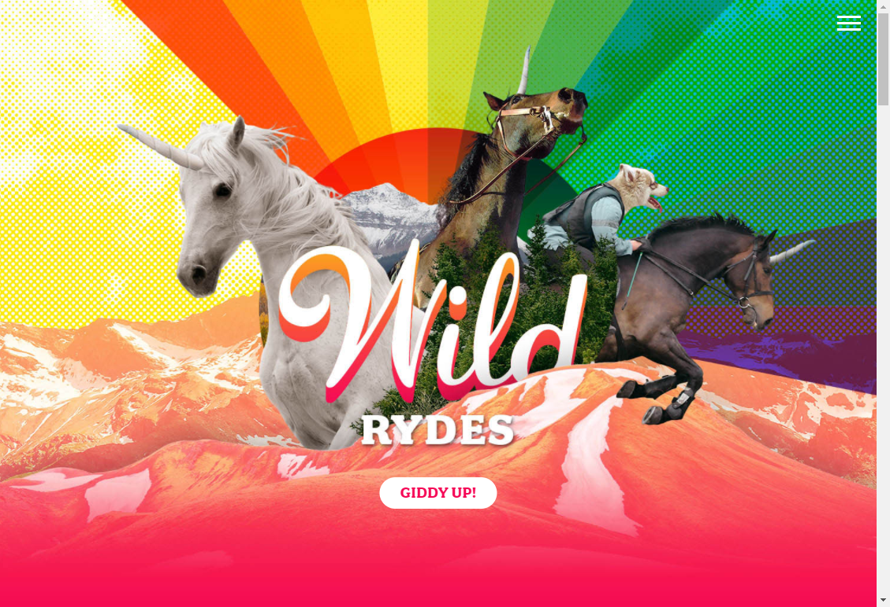

---
# アプリを体験する

4. マップがロードされたら、任意の位置 (乗馬場所) をクリック
5. [Request Unicorn] をクリック
6. 右のサイドバーの通知で、ユニコーンが向かっていることが表示され、続いて乗る場所にユニコーンのアイコンが移動すれば OK!


---
# アプリのアーキテクチャ

1. **Amplify**
継続的デプロイ (CD) と静的ホスティング
2. **Cognito**
ユーザー管理
3. **Lambda** + **DynamoDB**
バックエンドファンクション、スキーマレスデータベース
4. **API Gateway**
RESTful API の公開


---
# アプリで作成されるリソース

- [Amplify アプリ](https://console.aws.amazon.com/amplify/home?region=us-east-1#/) `first-serverless-app-2021`
- [Cognito ユーザープール](https://console.aws.amazon.com/cognito/users/?region=us-east-1) `WildRydes`
- [Lambda 関数](https://console.aws.amazon.com/lambda/home?region=us-east-1#/functions) `RequestUnicorn`
    - [IAM ロール](https://console.aws.amazon.com/iam/home?region=us-east-1#/roles) `WildRydesLambda`
    - [CloudWatch Logs ロググループ](https://console.aws.amazon.com/cloudwatch/home?region=us-east-1#logsV2:log-groups) `/aws/lambda/RequestUnicorn`
- [DynamoDB テーブル](https://console.aws.amazon.com/dynamodb/home?region=us-east-1#tables:) `Rides`
- [API Gateway](https://console.aws.amazon.com/apigateway/main/apis?region=us-east-1) `WildRydes`

---
# Amplify: 継続的デプロイと静的ホスティング

- Git ベースの継続的デプロイ
- HTML, CSS, JavaScript などの静的コンテンツのホスティング

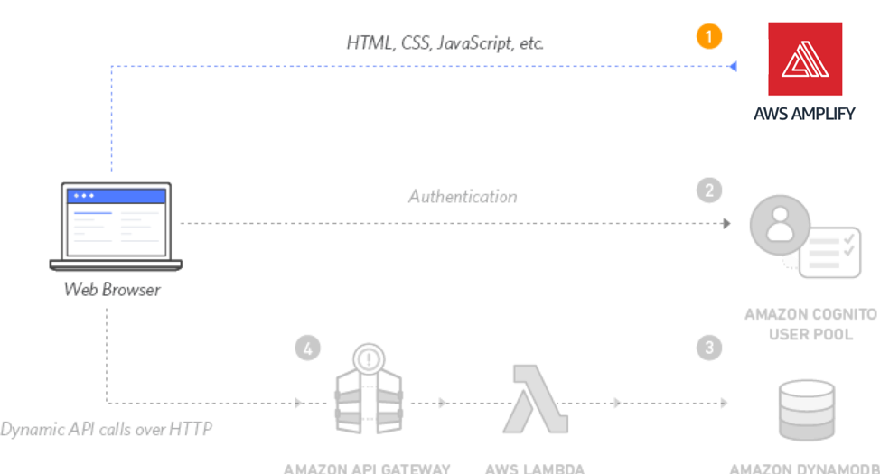

---
## リポジトリの準備

1. GitHub のリポジトリ [mseninc/first-serverless-app-2021](https://github.com/mseninc/first-serverless-app-2021) をフォークして自分のアカウントに追加
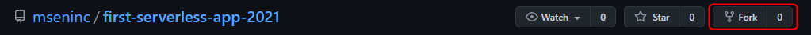
2. フォークできた状態
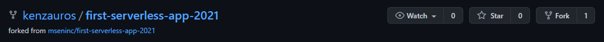
3. フォークしたリポジトリをクローンして VS Code を開く
```
cd <your repo dir>
git clone https://github.com/<your account>/first-serverless-app-2021
cd first-serverless-app-2021
code .
```

---
## Amplify の設定

1. [Amplify コンソール](https://console.aws.amazon.com/amplify/home) を開く
2. リージョンを **バージニア北部 (us-east-1)** に変更
3. Get started - Deliver の [Get started] を選択
4. GitHub を選択して [Continue]
5. AWS に Github への権限認可画面になるため、自分のアカウントであることを確認して [Authorize]

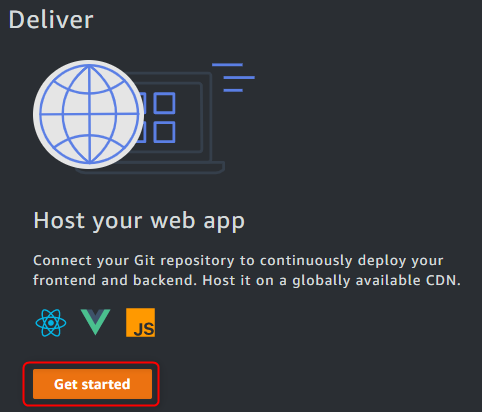

---
## Amplify の設定

6. [リポジトリブランチの追加] でリポジトリとブランチを選択して [次へ]
7. [ビルド設定の構成] は特に変更せず [次へ]
8. [確認] 画面でリポジトリを確認して[保存してデプロイ]

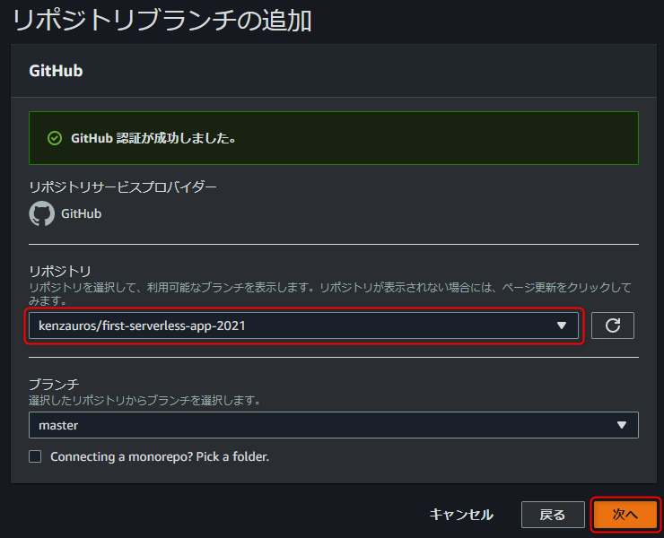

---
## Amplify デプロイ状況の確認

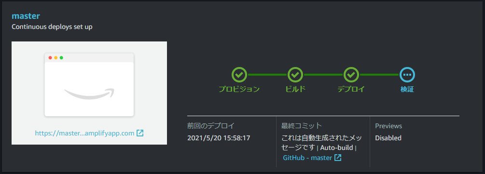
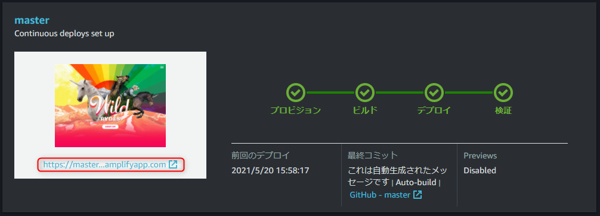

---
## Amplify 自動デプロイの確認

1. `index.html` を開き、 `title` タグを好きな文字列に変更
```html
<title>Wild Rydes - ユニコーン大好き！</title>
```
2. `index.html` をコミットしてプッシュ
```
git add index.html
git commit -m "Update page title"
git push
```
3. Amplify コンソールを確認するとデプロイされることを確認

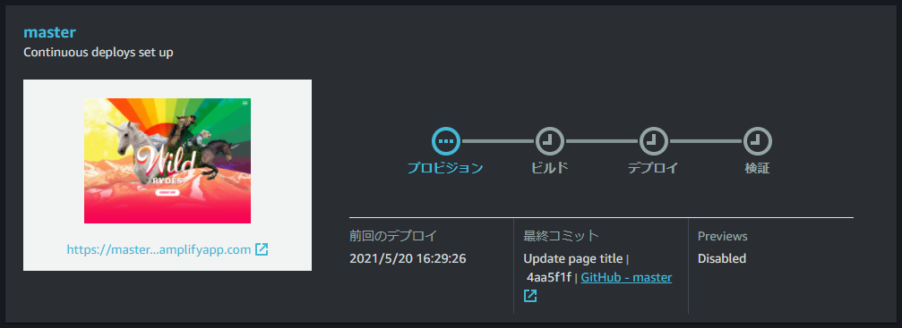


---


---
# Cognito: ユーザー管理

- マネージドのユーザー管理
- メールによるアカウント確認、OAuth、二要素認証などに対応
- パスワードポリシーの設定可能
- トークンは JWT
- ID のソースは Cognito ユーザープールのほか、各種 SNS や SAML などに対応


---
## ユーザープールの追加

1. [Cognito コンソール](https://console.aws.amazon.com/cognito/home?region=us-east-1) を開く
1. [ユーザープールの管理] → [ユーザープールを作成する] をクリック
1. プール名 `WildRydes` を入力して [デフォルトを確認する] (右図) 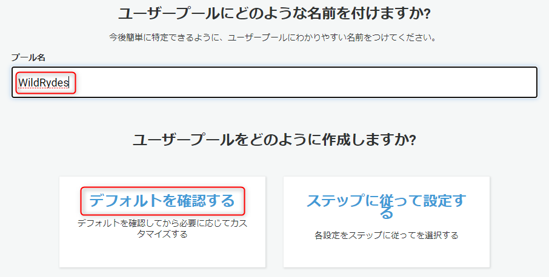
1. [プールの作成] をクリック
1. プール ID を確認する 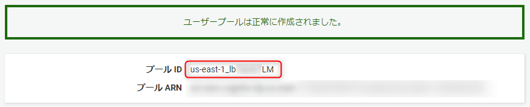

---
## ユーザープールにクライアントアプリを追加

1. [全般設定] → [アプリクライアント] → [アプリクライアントの追加]
2. 下記の設定で [アプリクライアントの作成] をクリック
    - アプリクライアント名: `WildRydesWebApp`<br>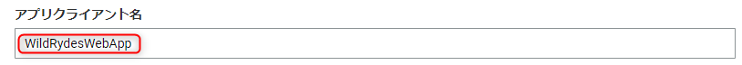
    - [クライアントシークレットの作成] のチェックを **外す**<br>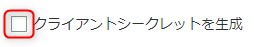
3. アプリクライアント ID を確認する<br>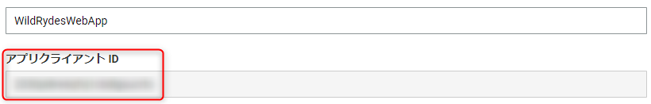

---
## ウェブサイトの設定を更新

1. VS Code で `js/config.js` を開き、 cognito セクションを設定
```js
   cognito: {
        userPoolId: 'us-east-1_lbTsxdsLM',
        userPoolClientId: '2030pi8re6qfvj1cbdlgsucrxx',
        region: 'us-east-1'
    },
```
2. `js/config.js` をコミット・プッシュ
```
git add js/config.js
git commit -m "Set cognito config"
git push
```

---
## ウェブサイトの設定を更新

3. Amplify でデプロイが完了したことを確認する
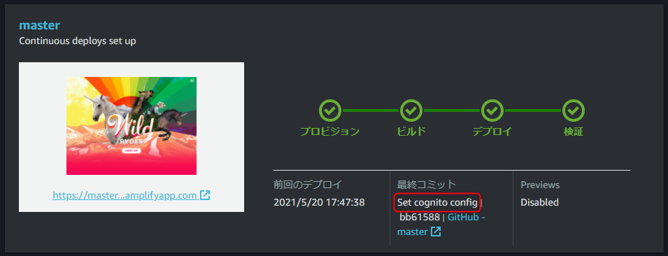

4. ホームページの  をクリック

---
## ユーザー登録してみる

5. 画面に従ってユーザー登録をしてみる。認証完了後、「API が設定されていない」というメッセージが表示されればOK

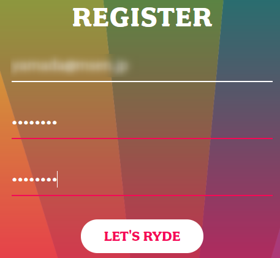

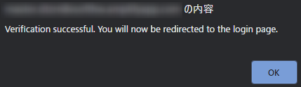
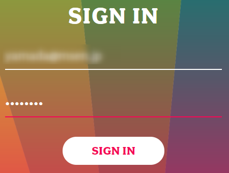
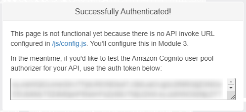


---


---
# Lambda + DynamoDB: バックエンドファンクション、データベース

- Lambda
    - 必要なときに必要な関数を呼び出す
    - 利用分のみの課金
    - 多様な言語での実装が可能
- DynamoDB
    - マネージド NoSQL データベース
    - スキーマレス (≠ 設計不要)


---
## DynamoDB テーブルの作成

1. [DynamoDB](https://console.aws.amazon.com/dynamodb/home?region=us-east-1) のコンソールを開く
2. [テーブルの作成] をクリック
3. テーブル名に `Rides`、パーティションキーに `RideId` を入力して [作成] 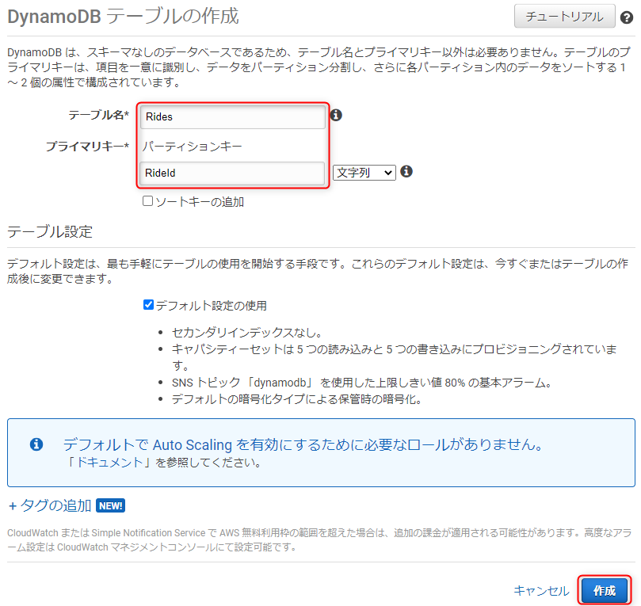
4. テーブルが作成されたら、テーブルの詳細で ARN を確認する<br>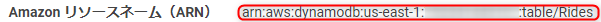

---
## Lambda 関数用の IAM ロールを作成

1. IAM コンソールの [ロール](https://console.aws.amazon.com/iam/home?region=us-east-1#/roles) を開く
2. [ロールの作成]
3. [AWS サービス] → [Lambda] → [次のステップ] 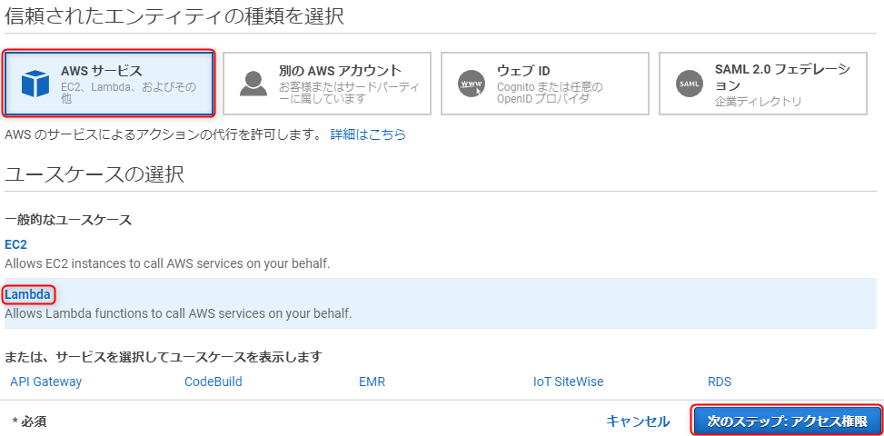

---
## Lambda 関数用の IAM ロールを作成

4. ポリシーのフィルタに `AWSLambdaBasicExecutionRole` と入力し、 `AWSLambdaBasicExecutionRole` にチェックをいれ、[次のステップ]
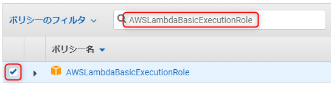
5. タグの追加画面はそのまま [次のステップ]
6. ロール名 `WildRydesLambda` を入力して [ロールの作成]

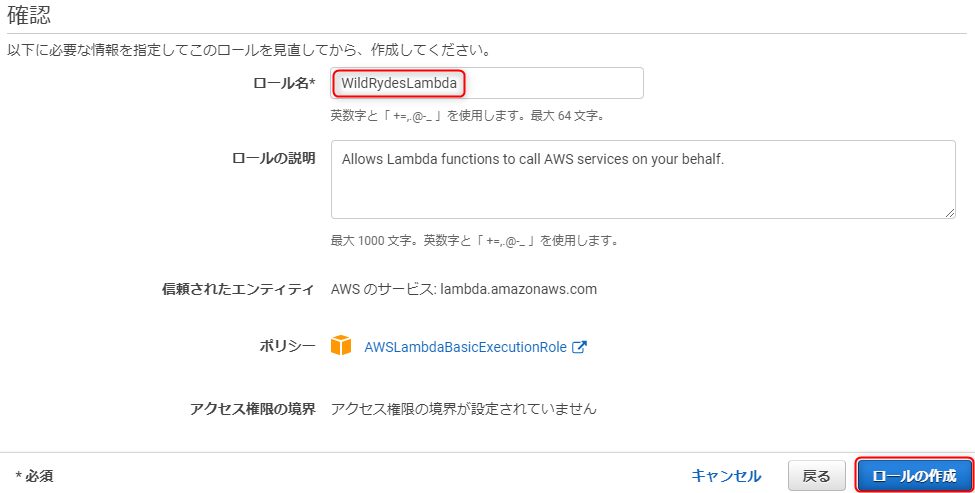

---
## Lambda 関数用の IAM ロールを作成

7. `WildRydesLambda` を選択して [インラインポリシーの追加]
8. サービス: `DynamoDB` の アクション: `PutItem` を指定
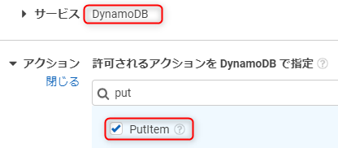
9. リソースで先ほど作成した DynamoDB の ARN を指定
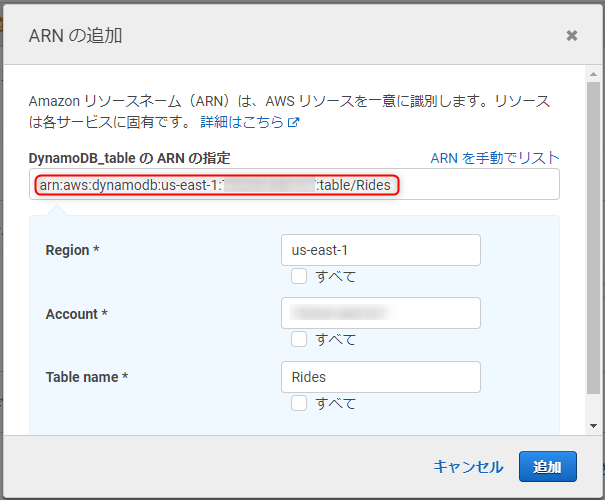

---
## Lambda 関数用の IAM ロールを作成

10. 名前に `DynamoDBWriteAccess` を入力し、リソース (DynamoDB) を確認して [ポリシーの作成]


---
## Lambda 関数を作成

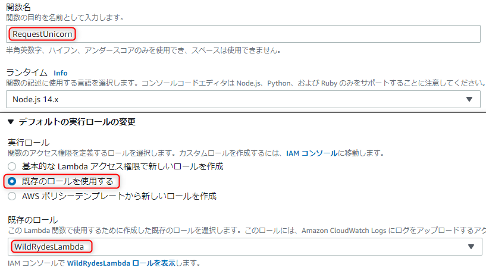

1. [Lambda コンソール](https://console.aws.amazon.com/lambda/home?region=us-east-1) を開く
2. 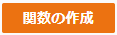 をクリック
3. [一から作成] をクリック
4. 下記の設定で  をクリック
    - 関数名: `RequestUnicorn`
    - ランタイム `Node.js 14.x`
    - デフォルトの実行ロールの変更
    - 実行ロール: `既存のロールを使用する`
    - 既存のロール: `WildRydesLambda`

---
## Lambda 関数を作成

5. `index.js` に `lambda/requestUnicorn.js` の内容を貼り付け、保存 → [Deploy]
<br>

---
## Lambda 関数のテスト

1. 関数のメイン編集画面で [Test] をクリック
1. [新しいテストイベントの作成] でイベント名に `TestRequestEvent` と入力
1. `lambda/TestRequestEvent.json` の内容をエディタにコピーして貼り付けて、 [作成] をクリック
1. 関数のメイン編集画面で再度 [Test] をクリック
1. 実行結果で Response が下記のようになっていることを確認
```js
{
  "statusCode": 201,
  "body": "{\"RideId\":\"mX4L_RXtxqAsULfRXMvpzw\",\"Unicorn\":{\"Name\":\"Bucephalus\",\"Color\":\"Golden\",\"Gender\":\"Male\"},\"UnicornName\":\"Bucephalus\",\"Eta\":\"30 seconds\",\"Rider\":\"the_username\"}",
  "headers": {
    "Access-Control-Allow-Origin": "*"
  }
}
```
1. [DynamoDB テーブル `Rides`](https://console.aws.amazon.com/dynamodb/home?region=us-east-1#tables:selected=Rides;tab=items) にデータが入っていることを確認


---


---
# API Gateway: RESTful API の公開

- マネージドの REST (Web) API サービス
- Cognito と連携した API 認証
- 今回は Lambda で作成した関数を API として公開するために利用


---
## API の作成

1. [API Gateway コンソール](https://console.aws.amazon.com/apigateway/main/apis?region=us-east-1) を開く
1. REST API の [構築] を選択
1. 下記の設定で [API の作成]
    - `REST`
    - `新しい API`
    - API 名: `WildRydes`
    - エンドポイントタイプ: `エッジ最適化`

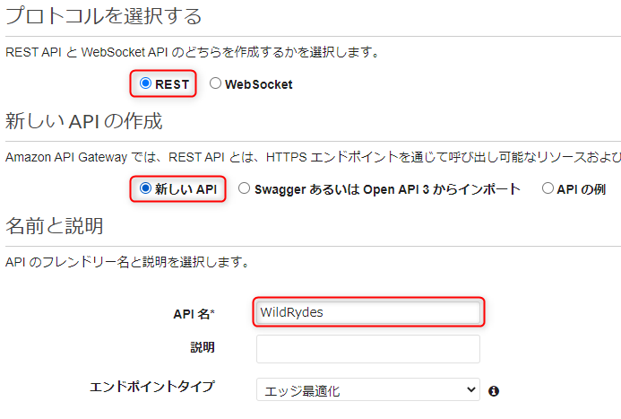

---
## オーソライザーの設定

1. [新しいオーソライザーの追加] をクリック
1. 下記の設定で [作成]
    - オーソライザー名: `WildRydes`
    - タイプ: `Cognito`
    - Cognito ユーザープール: `WildRydes`
    - トークンのソース: `Authorization`

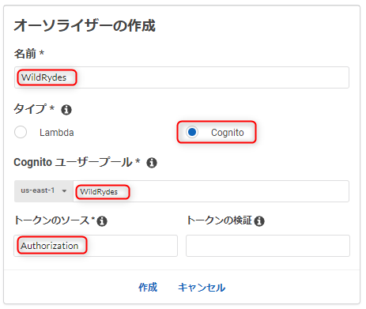

---
## オーソライザーの確認

1. `/ride.html` で表示されるトークンをコピーする
1. 追加した `WildRydes` オーソライザーの [テスト] をクリック
1. [認証トークン] にトークンをペーストし、 [テスト]
1. Response Code が 200 であることと、ユーザーのクレームを確認
```
{
    "aud": "2030pi8re6qfvj1cbdlgsucrto",
    "auth_time": "1621500712",
    "cognito:username": "kenzauros-at-example.com",
    "email": "kenzauros@example.com",
    "email_verified": "true",
    "event_id": "394b819f-2f58-41d2-8f5a-023946819005",
    "exp": "Fri May 21 00:04:54 UTC 2021",
    "iat": "Thu May 20 23:04:54 UTC 2021",
    "iss": "https://cognito-idp.us-east-1.amazonaws.com/us-east-1_lbTsxdsLM",
    "sub": "3676a4c8-f8bd-41f4-9339-12bb2882aab8",
    "token_use": "id"
}
```

<style scoped>
pre {
    font-size: 65%;
}
</style>

---
## リソースの作成

1. WildRydes API の下の [リソース] をクリック
1. [アクション] → [リソースの作成] を選択
1. 下記の設定で [リソースを作成]
    - リソース名: `ride`
    - リソースパス: `ride`
    - API Gateway CORS を有効にする: チェック

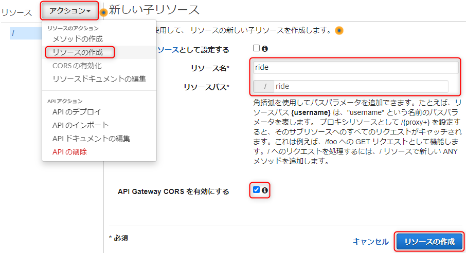

---
## メソッドの作成

1. `/ride` リソースが選択された状態で、[アクション] → [メソッドの作成] を選択
2. [POST] を選んでチェックマークをクリック 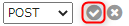
3. 下記のセットアップで [保存]
    - 統合タイプ: `Lambda 関数`
    - Lambda プロキシ統合の使用をチェック
    - Lambda リージョン: `us-east-1`
    - Lambda 関数: `RequestUnicorn`

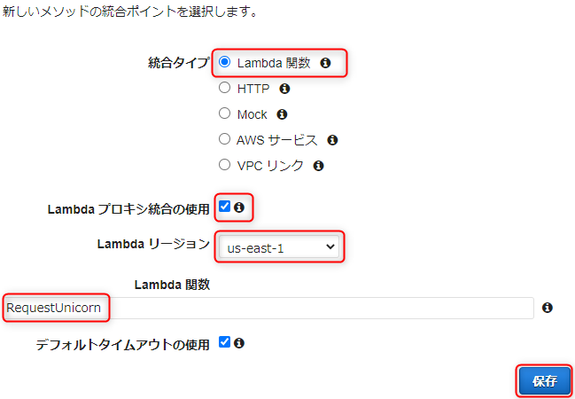

---
## メソッドの作成

4. 関数を呼び出すための権限付与を求められたら [OK]
5. [メソッドをリクエスト] カードを選択し、 [認可] の横の鉛筆アイコンを選択
6. ドロップダウンから `WildRydes` Cognito ユーザープールオーソライザーを選択し、チェックマークをクリック

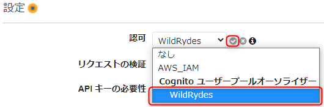


---
## API のデプロイ

1. `/ride` リソースが選択された状態で、[アクション] → [メソッドの作成] を選択
2. 下記のセットアップで [デプロイ]
    - デプロイステージ : `新しいステージ`
    - ステージ名 : `prod`
3. [URL の呼び出し] にある URL をコピー 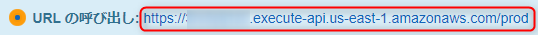


---
## クライアント側の設定を更新

1. VS Code で `js/config.js` を開き、 `api.invokeUrl` に API を設定
```js
window._config = {
    cognito: {
        userPoolId: 'us-east-1_lbTsxdsLM',
        userPoolClientId: '2030pi8re6qfvj1cbdlgsucrxx',
        region: 'us-east-1'
    },
    api: {
        invokeUrl: 'https://3rv5ytj1z0.execute-api.us-east-1.amazonaws.com/prod'
    }
};
```
2. `js/config.js` をコミット・プッシュ
```
git add js/config.js
git commit -m "Set api url"
git push
```
3. Amplify でデプロイを確認
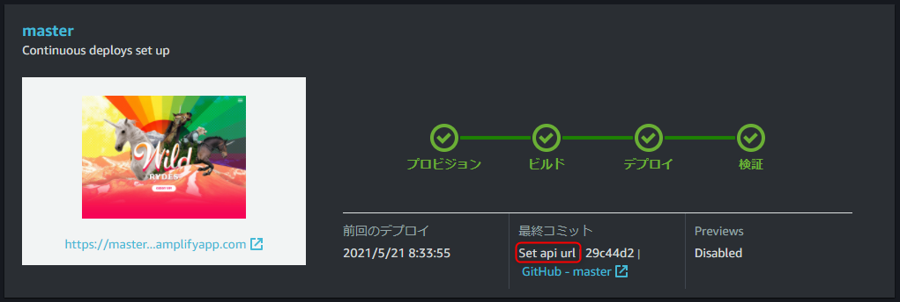

---
# 動作確認

1. `/ride.html` をリロード
1. マップがロードされたら、任意の位置 (乗馬場所) をクリック
1. [Request Unicorn] をクリック
1. 右のサイドバーの通知で、ユニコーンが向かっていることが表示され、続いて乗る場所にユニコーンのアイコンが移動すれば OK!
1. [DynamoDB のテーブル](https://console.aws.amazon.com/dynamodb/home?region=us-east-1#tables:selected=Rides;tab=items) にも今のリクエストが保存されていることを確認


---
# おさらい


---
# クリーンアップ

- [Amplify アプリ](https://console.aws.amazon.com/amplify/home?region=us-east-1#/) `first-serverless-app-2021`
- [Cognito ユーザープール](https://console.aws.amazon.com/cognito/users/?region=us-east-1) `WildRydes`
- [Lambda 関数](https://console.aws.amazon.com/lambda/home?region=us-east-1#/functions) `RequestUnicorn`
- [IAM ロール](https://console.aws.amazon.com/iam/home?region=us-east-1#/roles) `WildRydesLambda`
- [DynamoDB テーブル](https://console.aws.amazon.com/dynamodb/home?region=us-east-1#tables:) `Rides`
- [API Gateway](https://console.aws.amazon.com/apigateway/main/apis?region=us-east-1) `WildRydes`
- [CloudWatch Logs ロググループ](https://console.aws.amazon.com/cloudwatch/home?region=us-east-1#logsV2:log-groups) `/aws/lambda/RequestUnicorn`
